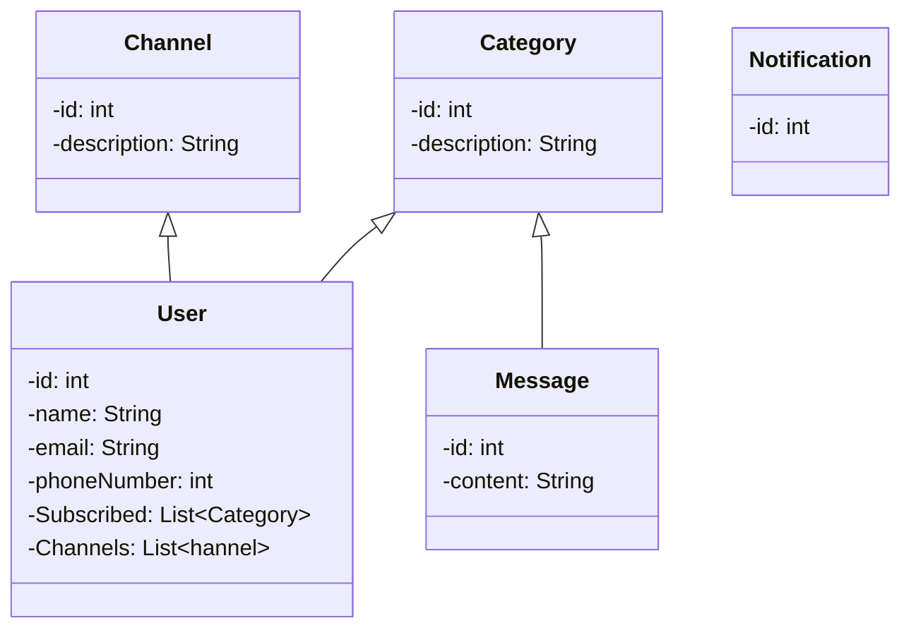

# Welcome to Gila Software Coding Challenge!

This is a coding challenge from **Gila Software**. I chose Python to fulfill this mission. My idea is to copy the instructions here and then create diagrams to illustrate and design my understanding.

After a good understanding and a reasonable design of the small project, I will move on to the implementation of the solution.

# Notification Test (Code Challenge)

We have to create a notification system that has the ability to receive a message and depending on
the category and subscribers, notify these users in the channels they are registered.

It will be **3** message categories:  
▪ Sports  
▪ Finance  
▪ Movies

And there will be **3 types of notifications**, each type should have its own class to manage the logic of
sending the message independently.  
▪ SMS  
▪ E-Mail  
▪ Push Notification

No notification will actually be sent or the need to communicate with any external APIs, only will
register the sent notification in an archive of Logs or in a database.

In the log, it will need to save all the information necessary to identify that the notification has been
sent correctly to the respective subscriber,such as the type of message, type of notification, user data,
time, etc.

No user administration is required, you can use a Mock of users in the source code, and they must
have the following information:  

• ID  
• Name  
• Email  
• Phone number  
• Subscribed [ ] here you need to list all the categories where the user is subscribed  
• Channels [ ] a list of the notification's channels (SMS | E-Mail | Push Notification)

As user interface you need to display 2 main elements.  
1. **Submission form**. A simple form to send the message, which will have 2 fields:  
• **Category**. List of available categories.  
• **Message**. Text area, only validate that the message is not empty.  
2. **Log history**. A list of all records in the log, sorted from newest to oldest.  

We will evaluate:  

• Architecture of the application and software design patterns.  
• OOP and Scalability (ready to add more types of notifications).  
• Manage requests to the Server by RESTful APIs.  
• Unit testing  
• For manual tests, register at least 3 users with different configurations.

# Basic Design

Em uma leitura inicial, temos CATEGORIAS e CANAIS/TIPOS de comunicacao onde USUARIOS se registram e recebem MENSAGEMS (tem dentre outros os atributos categoria e tipo).

Nao havera envio de mensagens, mas apenas o registro do envio em um arquivo de logs (optamos pelo arquivo em detrimento do banco de dados). Nesse log, devera haver o registro de todos os dados da mensagem, o id do usuario e um timestamp. 

Estes LOGs representam as notificacoes. Meu entendimento eh de que nao serao gravados os ids das mensagens e usuarios, mas os dados diretamente no arquivo de logs.

Cada tipo de envio de mensagem (SMS, e-mail e push notification) deve ter sua propria dinamica de envio.

## Class Diagram

